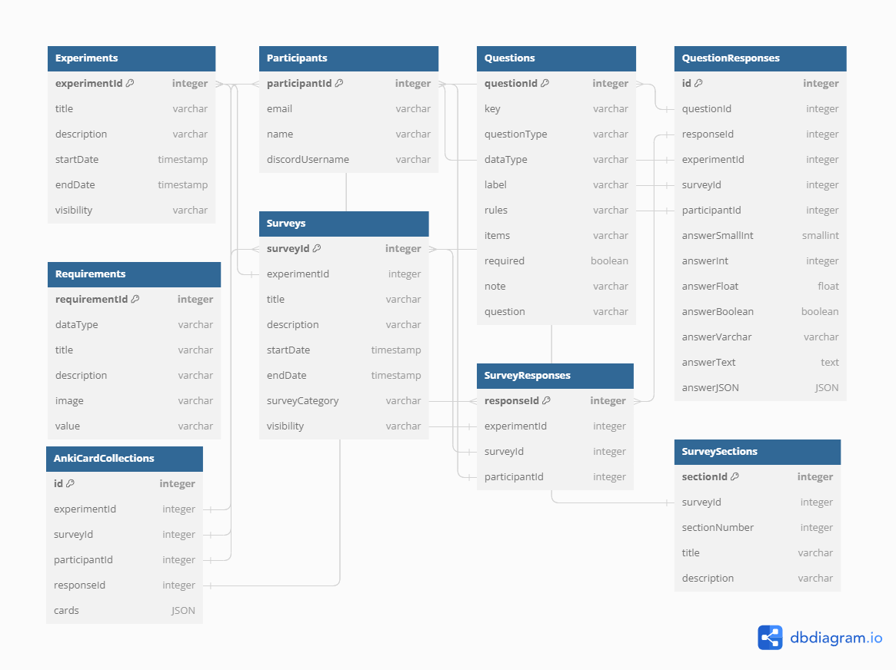

# Migaku Experiment Platform

Platform for Migaku (previously Mass Immersion Approach, or M.I.A.) to manage foreign language learning experiments.

## Features

- Front-end for experiment participants to register for experiments, complete custom surveys, and view past experiment results
- Backend design enables us to run concurrent experiments, re-use surveys across experiments, integrate with software like Anki (to collect/analyze more data, like user card collections), and query data across experiments/surveys for analysis
- Discord integration allows for restricting experiment participation to members of the Discord community and allows us to programmatically direct-message participants

## Selected Media

### High-level MySQL Schema

(excluding many-to-many intermediary tables)

### Audio vs Text Cards Experiment Results

### MIA Community Census Survey #1

### Anki Integration Usage Guide (YouTube Video)

## Development Environment Setup

1. `git clone https://github.com/shanrauf/Migaku-Experiment-Platform.git`
2. Ask Shan for .env credentials
3. Setup MySQL local server (see Shan's config [here](public/shan_mysql_config.png))
4. `npm run setup` # Installs dependencies, migrates development database, etc

## Develop

To run the frontend or back-end, enter the relevant directory and run `npm install && npm start`

## Deploy

Using CodePipeline and CodeDeploy, the code is automatically deployed when you push code to Github.

### How to Setup an EC2 Instance (Ubuntu 16.04 LTS)

1. `cd / && sudo touch install`
2. `sudo nano install` and copy/paste instructions from `scripts/install_dependencies`
3. `sudo chmod u+x install && sudo ./install`
4. `sudo rm /etc/nginx/sites-available/default`
5. `sudo touch /etc/nginx/sites-available/default` and paste contents of `/scripts/default` (frontend static files and /api proxy)
6. `sudo systemctl restart nginx`
7. Manually add `.env` file to `/opt`
8. Push code to master to deploy
